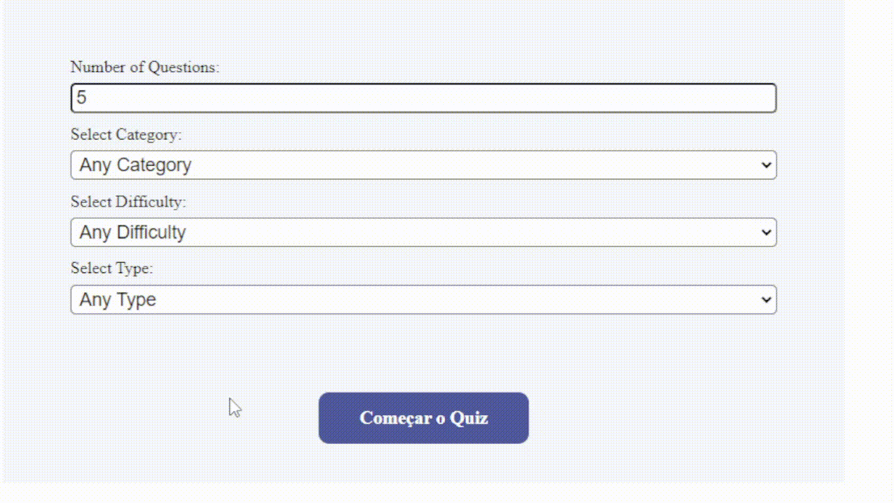

# Quizzical-trivia using React
[](https://quizical-trivia.netlify.app/)
- 🔗 Aplicação publicada no [Netlify](https://quizical-trivia.netlify.app/) ⬅️
- 🔗 Link para o design no [Figma](https://www.figma.com/file/E9S5iPcm10f0RIHK8mCqKL/Quizzical-App?node-id=0%3A1)

## Como jogar
- Pra quem prefere jogar em português



- Basta selecionar as opções desejadas(não é obrigátorio especificar)
- A quantidade de perguntas varia de 1 a 50 no máx
- Escolha as respostas corretas e verifique as respostas
- Boa sorte!

## 📋 Requisitos do projeto

### Criar um quiz Webapp que lista perguntas

✔️ Criar duas telas, (começar & questões)

✔️ Puxar 5 questões da [OTDB API](https://opentdb.com/api_config.php)

✔️ Contabilizar os acertos e renderizar o score em forma de fração

✔️ Indicar quais foram as respostas corretas

## 🎁 Extras
### Adicionado opções de escolha para o quiz,
✔️ Quantidade de perguntas

✔️ Categoria

✔️ Dificuldade

✔️ Tipo

✔️ Botão redefinir opcões

✔️ Background personalizado para cada categoria

## 🛠 Tecnologias

 ReactJS

 CSS

## ▶️ Inicializando o projeto

- ### **Pré-requisitos**

  - **Node.js**;
  - **Git**
  - Gerenciador de pacotes **npm** ou **yarn**

Em seguida, clone o repositório

```sh
  $ git clone https://github.com/peustratt/tenzies.git
```

E depois:

```sh
  # Abra pasta do projeto
  $ cd tenzies
  # Instale as dependencias
  $ yarn ou npm install
  # Rode a aplicação
  $ yarn start ou npm run start
```
